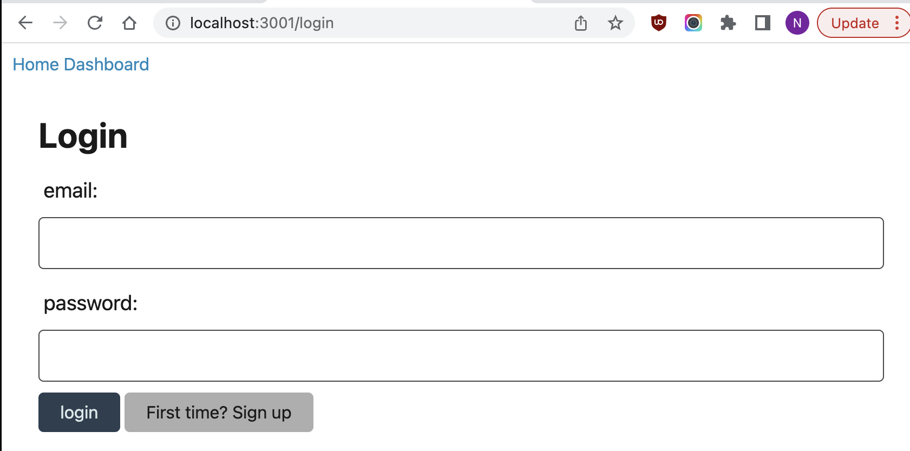
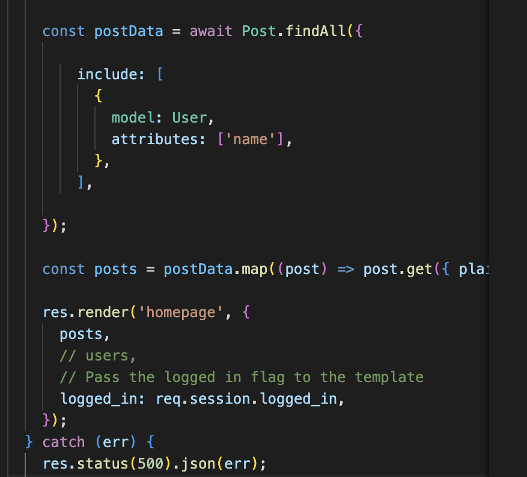

# Tech Blog

## Description
When you open the site, you can log in.

## Visuals

This is what is seen when you go to login as a user.

This snippet of code gets all the posts.

## Installation
Run NPM I once you clone it over to your local computer then type in the CLI npm run start